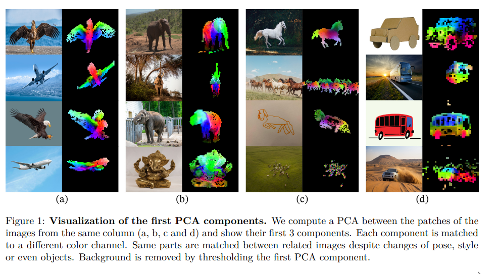
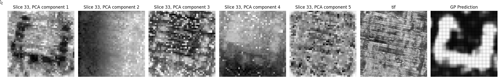
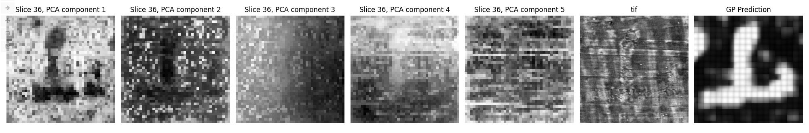

# Unsupervised Ink Detection with DINOv2

This repository contains experiments related to unsupervised ink detection with DINO in an effort to implement an **ink detector that does not require and has not been trained with any labels**. It includes a [Colab Notebook]() that lets you easily load some crop of a segment and visualize the output. 

One of the problems with current supervised ink detection models is that they only work if we have ink labels, i.e. only on Scroll 1. The idea here is that, if we are able to obtain a somewhat decent detector that does not require labels, we could be able to find some letter/traces of ink in other scrolls and repeat the same ML/Human interaction loop that led to the Grand Prize results! 

## What is DINO? 

Briefly, DINO ([[1]](https://arxiv.org/abs/2104.14294), [[2]](https://arxiv.org/abs/2304.07193)) is a vision transformer that has been trained on lots of images in a self-supervised way (without any sort of labels). The authors of DINO show that the model learns to pay attention to objects, we can think about it as a *"rudimentary object detector"*.

*Source: [DINOv2 paper](https://arxiv.org/abs/2304.07193)*

Given these results, I decided to test if it works on scroll data. Similar to the paper, what I did is to take a crop of a segment and use it as an input to DINO. Then, I applied PCA to the output for every layer of the segment. As it can be seen in the attached image, that the first and third components obtained by applying PCA to the 34th layer of the crop containing Casey's pi reveal traces of ink. I have also found some examples in other segments:

The cool thing about this is that it **doesn't require labels at all and the model has not been trained without any sort of scroll data**! The not-so-cool thing is that it only works on really obvious examples, where we can visually see crackle. However, the PCA output is easier to visualize, and given this preliminary results, I think that they can be improved.

## Scripts

Below there is a brief description of every script in the repository. I specially recomment starting with the notebook as it does not require you to install anything on your computer, and even have GPU.

- Notebook, simple visualization/cropping
- Script, generate whole visualization. Right now it is extremely unefficient so work with small segments!
- Dataset, etc.

